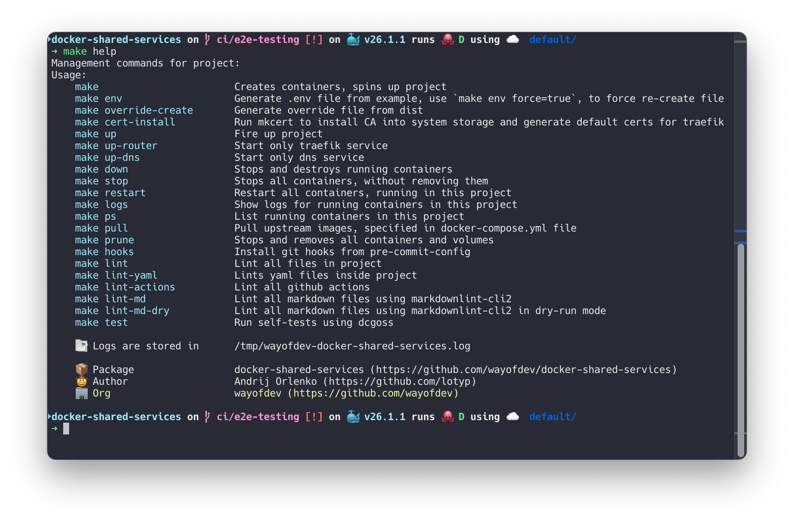

# Contributing

If you would like to contribute to this project, please open an issue or a pull request. We are always looking for ways to improve the project and would love to hear your ideas.

The latest changes are always in master branch, so please make your Pull Request against that branch.

<br>

## 🚩 Development Requirements

Before you begin, you will need to set up your local development environment. Here is what you'll need:

- **Operating System**: macOS Monterey+, Linux, or Windows with WSL2.
- **Docker**: Version 26.0.0 or newer. Installation guides:
  - [Docker on Ubuntu 22.04](https://www.digitalocean.com/community/tutorials/how-to-install-and-use-docker-on-ubuntu-22-04)
  - [Docker Desktop on Mac](https://docs.docker.com/desktop/install/mac-install/)
- **Homebrew** (macOS only): Install via [brew.sh](https://brew.sh/).
- **mkcert** Install via [brew.sh/formula/mkcert](https://formulae.brew.sh/formula/mkcert#default) or follow their instructions [here](https://github.com/FiloSottile/mkcert?tab=readme-ov-file#installation).

### → Optional Tools

- [Pre-commit](https://pre-commit.com) — Automates the running of git pre-commit hooks.
  - Installation: `brew install pre-commit` and `make hooks`
- [Cz-git](https://cz-git.qbb.sh) — Commitizen adapter, that assists in formatting git commits.
  - Installation: `brew install czg`

<br>

## 🛠️ Makefile

This project uses a Makefile to streamline common development tasks. The Makefile includes utilities for managing Docker environments, running tests, and linting code.

```bash
make help
```



### → Key Commands

- `make up`: Starts all services using Docker Compose.
- `make up-router`: Starts only traefik router container.
- `make up-dns`: Starts only dnsmasq container.
- `make down`: Stops and removes all services.
- `make stop`: Stops all services.
- `make logs`: Displays logs for all services.
- `make lint`: Executes all linting procedures for YAML, PHP, and Composer files.
- `make commit`: Runs cz-git, a commitizen adapter for commit message formatting in a native environment.

Refer to the output of `make help` for a comprehensive list of available commands.

<br>

## 💻 Workflow

> [!IMPORTANT]
>
> Please feature/fix/update... into individual PRs (not one changing everything)

- **Fork the Repository**: Start by forking the repository to your GitHub account.
- **Create a Branch**: In your fork, create a new branch for your work. Name it appropriately based on the feature, fix, or update you're working on.
- **Make Your Changes**: Implement your changes
- **Run Tests**: Ensure all tests pass and the code adheres to the coding standards.
- **Update Documentation**: If you've made changes that affect the project's documentation, ensure it is updated.
- **Run Linters**: Ensure your code passes all linting checks using `make lint`.
- **Commit Your Changes**: Use the [Conventional Commits](#-commit-message-guidelines) standard for your commit messages. You can use `make commit` to assist in creating commit messages.
- **Push Your Changes**: Push your branch to your fork on GitHub.
- **Open a Pull Request**: Submit a pull request to the `master` branch of the original repository. Ensure your PR is focused, addressing a single feature, fix, or improvement.

<br>

## ⚡️ Continuous Integration with GitHub Actions

Our project employs [GitHub Actions](https://github.com/features/actions) for continuous integration, ensuring code quality and reliability. We encourage contributors to review our workflow configurations to understand the CI processes:

- [`workflows/apply-labels.yml`](workflows/apply-labels.yml)
- [`workflows/auto-merge-release.yml`](workflows/auto-merge-release.yml)
- [`workflows/coding-standards.yml`](workflows/coding-standards.yml)
- [`workflows/create-release.yml`](workflows/create-release.yml)
- [`workflows/e2e-macos.yml`](workflows/e2e-macos.yml) — **Currently disabled**
- [`workflows/e2e-ubuntu.yml`](workflows/e2e-ubuntu.yml) — **Currently disabled**
- [`workflows/shellcheck.yml`](workflows/shellcheck.yml)

<br>

## 📝 Before You Contribute

- **Tests**: Include tests that cover any new features or bug fixes, if applicable.
- **Code Quality**: Utilize `make lint` for code style checks.
- **Documentation**: Update relevant documentation to reflect your changes, ensuring other developers can understand and use your contributions effectively.
- **Commits**: use Conventional Commits standard to create a commit

<br>

## 📩 Commit Message Guidelines

We follow the [Conventional Commits](https://www.conventionalcommits.org/en/v1.0.0/) standard. Please structure your commit messages as follows, using the appropriate prefix:

**Examples:**

```bash
git commit -am 'feat: some feature was introduced'
git commit -am 'fix: something has been fixed'
```

**Allowed Prefixes:**

| Prefix     | Purpose                                                       |
|------------|---------------------------------------------------------------|
| `feat`     | Introduces a new feature                                      |
| `fix`      | Fixes a bug                                                   |
| `perf`     | Improves performance                                          |
| `docs`     | Documentation only changes                                    |
| `style`    | Code style changes (formatting, missing semi-colons, etc.)    |
| `deps`     | Updates dependencies                                          |
| `refactor` | Code changes that neither fixes a bug nor adds a feature      |
| `ci`       | Changes to our CI configuration files and scripts             |
| `test`     | Adding missing tests or correcting existing tests             |
| `revert`   | Reverts a previous commit                                     |
| `build`    | Changes that affect the build system or external dependencies |
| `chore`    | Other changes that don't modify src or test files             |
| `security` | A code change that fixes a security issue                     |

<br>

## 🔍 Coding Standards and Tools

We enforce coding standards to maintain high code quality and readability. Here's a list of tools we use:

### → Yaml Lint

We use [`yamllint`](https://github.com/adrienverge/yamllint) to enforce coding standards in YAML files.

To lint yaml files run:

```bash
make lint-yaml
```

by default, [`cytopia/yamllint`](https://github.com/cytopia/docker-yamllint) Docker image will be used to run linter.

### → Action Lint

We use [`actionlint`](https://github.com/rhysd/actionlint) to enforce coding standards in GitHub Actions workflows.

To lint GitHub Actions run:

```bash
make lint-actions
```

### → Markdown Lint

We use [`markdownlint-cli2`](https://github.com/davidanson/markdownlint-cli2) to enforce coding standards in Markdown files.

To lint markdown files run:

```bash
make lint-md-dry
make lint-md
```

<br>

## 🧪 Tests

We use [`dgoss`](https://github.com/goss-org/goss/blob/master/extras/dgoss/README.md) and [`dcgoss`](https://github.com/goss-org/goss/blob/master/extras/dcgoss/README.md) to test Docker images and `docker-compose` files.

Run

```sh
make tests
```

to run all the tests.

<br>

## 📦 Pre-commit Hooks

Pre-commit hooks are an optional but highly recommended way to automate the linting and quality checks before committing changes to the repository. This project provides a predefined configuration that helps in maintaining code quality and consistency.

### → Configured Hooks

Our pre-commit configuration includes several hooks:

- **Trailing Whitespace**: Removes unnecessary trailing spaces.
- **End-of-File Fixer**: Ensures that files end with a newline.
- **Check Added Large Files**: Prevents accidentally adding large files to the git repository, with a current limit set to 600 KB.
- **Commitizen**: Ensures commit messages meet the conventional commit format. This hook is triggered at the commit message stage.

### → Installing Pre-commit Hooks

To utilize these hooks, you first need to install them using the command provided by the Makefile:

```bash
make hooks
```

<br>
